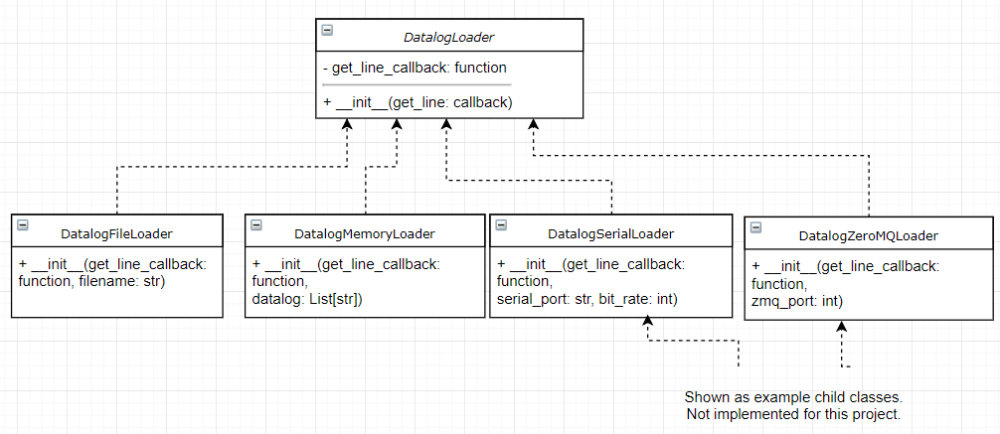

# Description

This is an exercise in object oriented design using Python.  

Lines from a datalog of timestamps and electrical powerline measurements will be read and put through a moving average filter, and output to a different file.  

Input lines appear as:
  ```
  T, kW, V, I
  ```
- T: ISO 8601 formatted timestamp
- kW: Power measurement
- V: Voltage measurement
- I: Current measurement
  
Output lines will appear as:
```
<time>, <kW>, <V>, <I>, <kW-avg>, <V-avg>, <I-avg>
```

Where the first four fields are the input values for each timestamp and the avg fields are the 5-second sliding window average of the corresponding input field, output only when there are no gaps in the data for the previous five seconds.

Certain anomalies are detected, and are logged in the output when detected:

    - Time gaps greated than 1.5 seconds between inputs
    - kW values < 0.0
    - V values outside range of 480 V +/- 5.0 V
    - I values < 0.0

# Requirements
* Python 3.6+

That's it!  No libraries that don't come with stock Python 3.6 are needed.

# Running

```shell
python Process_Powerline_File.py inputdata.dat outputfile.dat
```

# Testing

From the project directory, run:
```
python -m unittest discover pyPowerLine/test
```

The dataloader will be tested to 

## PowerlineDataProcessor

The PowerlineDataProcessor will use object mocking to make sure it calls an input function and an output function.

Parsing will be tested with unittests


# Design

## DatalogLoader
An abstract class DatalogLoader provides a .get() method that will return one line of telemetry.  DatalogFileLoader will be implemented to solve the problem, and DatalogMemoryLoader will be used for testing.

This architecture lets us handle telemetry streams that are possibly too big to fit in memory, or that are streaming, i.e. streamed one measurement at a time over a connection of some sort.



* get():
Returns one line of telemetry as a string.  If this won't be possible, i.e. there are no more lines in an input file or a socket is closed, return None.

## DataProcessor

* run():
Calls the callback that gets a line of telemetry and processes it in an output line, which is then sent to the write function callback.  Continues until get() has a problem.
