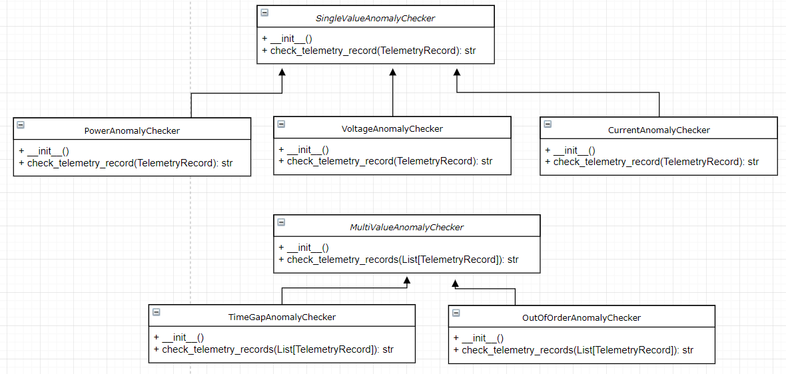

# Description of Problem

This is an exercise in object oriented design using Python.  

Lines from a datalog of timestamps and electrical powerline measurements will be read and put through a moving average filter, and output to a different file.  

Input lines appear as:
  ```
  T, kW, V, I
  ```
  The data fields are:
- T: ISO 8601 formatted timestamp
- kW: Power measurement
- V: Voltage measurement
- I: Current measurement
  
Output lines will appear as:
```
T, kW, V, I, kW-avg, V-avg, I-avg
```

Where the first four fields are the input values for each timestamp and the avg fields are the 5-second sliding window average of the corresponding input field, output only when there are no gaps in the data for the previous five seconds.

Certain anomalies are detected, and are logged in the output when detected:

    - Time gaps greated than 1.5 seconds between inputs
    - kW values < 0.0
    - V values outside range of 480 V +/- 5.0 V
    - I values < 0.0

I also noticed an out-of-order pair of telemetry points in the sample input.

# Problem Assumptions
- Input data will be properly formed. I.e. it will never fail to be parsed correctly according to its schema, maybe because a filter microservice has already removed these values
- Anomalies that aren't time gaps will still be used in the moving average calculations.  A downstream microservice reading anomaly messages could deal with these and decide what to do.

It was initially assumed that data would not arrive out of order, but there was one case of that in the sample input file.  This is checked for and reported as an anomaly.

# Requirements
* Python 3.6+

That's it!  No libraries that don't come with stock Python 3.6 are needed.

If it is desired to run the coverage test below, then the following PyPI packages are needed:
* nosetests
* coverage
```
pip install nose
pip install coverage
```


# Running

An input data file inputdata.dat is provided.  This was originally named telemetry[1].dat but was renamed since square brackets can be tricky to deal with in a command shell.

```shell
python ProcessPowerlineFile.py inputdata.dat outputfile.dat
```

The input file will be processed and the output will appear in the outputfile.dat in the above case.

# Running Tests

To run the unit tests, from the project directory, run:
```
python -m unittest discover pyPowerLine/test
```

100% code coverage was not obtained for this short exercise or attempted, but Test-Driven-Development was used to help refine the design after initial whiteboarding.

A coverage test could be run, using nose if available, via:
```
nosetests pyPowerLine --with-coverage
```

The coverage result by the end of the exercise was 66%:


# Design

The overall dataflow is based around three abstract classes:
* **DatalogLoader**
* **DataProcessor**
* **DatalogWriter**

Each class is purely abstract, i.e. not instantiatable. They serve as abstraction of input and outputs, as well as the processing algorithm performed between input and output.

Additional classes descried below contain telemetry and check for data anomalies.


## DatalogLoader
An abstract class DatalogLoader provides a .get() method that will return one line of telemetry. 

This architecture lets us handle telemetry streams that are possibly too big to fit in memory, or that are streaming, i.e. streamed one measurement at a time over a connection of some sort.

Here is an inheritance diagram for DatalogLoader. Note that in this implementation, only DatalogFileLoader is implemented.


### Methods:
* get():
Returns one line of telemetry as a string.  The string is not newline terminated.  If this won't be possible, i.e. there are no more lines in an input file or a socket is closed, returns **None**.

* close():
Closes the underlying data source, i.e. the file or socket.

## DatalogWriter
An abstract class DatalogWriter provides a .put() method that will write one line of telemetry to an underlying destination.  

Like **DatalogLoader**, this will let us handle different kinds of destinations.

Here is an inheritance diagram for DatalogWriter. Note that in this implementation, only DatalogFileWriter is implemented.


* put(str):
Writes one line of telemetry as a string.

* close():
Closes the underling destination, i.e. the file or socket.

## DataProcessor

This is an abstract base class that uses dependency injection to call the get() and put() methods of a DatalogLoader and DatalogWriter object respectively.

The dataflow works like this:


And the abstract interitance as implemented is:


* \_\_init\_\_(function get_function, function put_function): Instantiates the class with pointers to functions that should be implemented by a **DatalogLoader** and a **DatalogWriter**

* run():
Calls the callback that gets a line of telemetry and processes it in an output line and list of anomaly strings, which are then sent to the write function callback.  Continues until get() has a problem.

* str, List[str] process_line(str):
Called by run() each time a telemetry line is read. Returns the processed telemetry line, and a list of anomaly strings.

### PowerlineDataProcessor

This subclass performs the processing specific to this problem.

It keeps a buffer of one moving average window worth of samples in a buffer.  It checks the timestamps of old values and discards them if they are too old, keeping the memory footprint low.

Class **TelemetryRecord** encapsulates an input data record but is only used by this **PowerlineDataProcessor** and the **AnomalyChecker**; the **DatalogLoader** and **DatalogWriter** are agnostic to them, to achieve loose coupling.

There is also an inheritance tree from abstract class **AnomalyChecker**, which has several child classes that each override a *check_telemetry_record* method.  The **PowerlineDataProcessor** maintains a list of anomaly checkers, and passes **TelemetryRecord** objects to each one to receive any anomaly messages, or None if there is no anomaly detected by the checker.  Anomalies apply to either a single telemetry measurement, or across several (in the case of the time gaps).

Here are the anomaly checkers that were implemented:



# Test Plan

## Unit Testing

Individual classes will be unit tested to assure their correct output, such as:
* Reading of lines correctly from a file by **DatalogFileLoader**
* Writing of lines to a file by **DatalogFileWriter**
* Parsing of telemetry into a **TelemetryRecord** object by **PowerlineDataProcessor**

Object mocking will be used with the **DataProcessor** class to ensure it calls the correct methods that have been injected into it.  The prevention of instatiating abstract base classes will be suppressed so that it can be unit tested like this.  The trick to do this will be to use the following as the TestCase setUp method:
```python
    def setUp(self):
        # allow instantiation of an ABC for testing
        DataProcessor.__abstractmethods__ = set()
```


## Integration Testing

Some hand-calculated outputs should be checked against program output to verify correctness.  The provided input file containes examples of each of the anomalies, so is a good check for these as well.

## Continuous Integration

The unit tests should be run automatically after every push the central repository.  This hasn't been implemented for this implementation.

## Code Coverage

A code coverage check should be run as part of the continuous integration process.  There are many programs or services for this with python, such as nose.

## Acceptance
The unit tests and integration test must all pass. 

# What would I do differently
If I were to do this exercise again, I would:

- Pass a cancellation token of some sort to **DataProcessor**, to allow graceful shutdown from another thread when reading from an source that has a potentially infinite amount of data, like a socket for example
- Make the **SingleValueAnomalyChecker** and **MultiValueAnomalyChecker** abstract base classes both themselves descend from another abstract base class, **AnomalyChecker**, and refactor somewhat how anomaly messages are generated in order to simplify the client code.

- It would be resiliant to out-of-order data, inserting it in the correct place in the moving average filter buffer when it does arrive. 
- The moving average filter is over 5 seconds, but the time stamps aren't synchronous with 5 seconds so we might not really be exactly averaging over 5 seconds.  If this is important, the data could be interpolated to fit a 1 Hz sample rate.